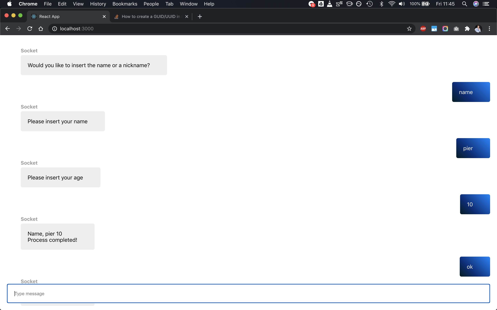

# MMCC - MultiModalChatbotCreator

This project is based on the paper "A Conceptual Framework for Multi-modal Process-driven Conversational
Agents" [TODO WIP LINK]. It provides a framework that, if kept updated with the inputs from the user,
guides him through an appropriately defined process, regardless of the input type.

The framework provides the core functionalities, it is a python package that can be used in any application.
The frontend provides an implementation of React components that use the framework via a backend.

* [frontend](frontend/src/react-mmcc/README.md) documentation
* [backend](backend/README.md) documentation
* [framework](framework/README.md) documentation

## Docker

To use Docker:

* Download and install Docker
* Clone this repo
* Place the process configuration files in `backend/config` (you can copy them from `backend/examples`)
* From the root directory of the repo run `docker-compose up -d`
* A MMCC backend with your process is now running on port `8765`!
* To stop it, run `docker compose down`

## Screenshots

